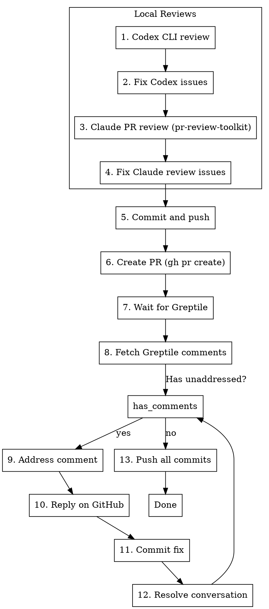

# Codex PR Review Cycle

## Overview

Full code review lifecycle: Codex review → fix → Claude PR review → fix → create PR → Greptile review → address feedback → resolve conversations.

## Workflow



## Step Details

### 1. Codex CLI Review

```bash
codex review --uncommitted
```

Options:
- `--uncommitted` - Review staged, unstaged, and untracked changes
- `--base main` - Review against a specific branch

### 2. Fix Codex Issues

Apply fixes for issues Codex identified. Priority:
1. Security issues
2. Bugs
3. Code quality

### 3. Claude PR Review

Invoke the pr-review-toolkit skill:

```
/pr-review-toolkit:review-pr all
```

This runs specialized agents:
- **code-reviewer** - CLAUDE.md compliance, bugs, quality
- **silent-failure-hunter** - Error handling issues
- **pr-test-analyzer** - Test coverage gaps
- **type-design-analyzer** - Type design quality
- **comment-analyzer** - Comment accuracy
- **code-simplifier** - Code clarity

### 4. Fix Claude Review Issues

Address issues by priority:
1. Critical (must fix)
2. Important (should fix)
3. Suggestions (nice to have)

### 5. Commit and Push

```bash
git add -p  # Stage selectively
git commit -m "Address review feedback from Codex and Claude"
git push -u origin HEAD
```

### 6. Create PR

```bash
gh pr create --title "..." --body "## Summary
...

## Reviews Completed
- [x] Codex CLI review
- [x] Claude PR review (pr-review-toolkit)
"
```

### 7. Wait for Greptile

Poll for Greptile review completion using MCP:

```
mcp__plugin_greptile_greptile__list_merge_request_comments
  name: "owner/repo"
  remote: "github"
  defaultBranch: "main"
  prNumber: <PR_NUMBER>
  greptileGenerated: true
```

Or check via gh:
```bash
gh pr view --comments | grep -i greptile
```

### 8. Fetch Greptile Comments

Get unaddressed Greptile comments:

```
mcp__plugin_greptile_greptile__list_merge_request_comments
  name: "owner/repo"
  remote: "github"
  defaultBranch: "main"
  prNumber: <PR_NUMBER>
  greptileGenerated: true
  addressed: false
```

### 9-12. Address Each Comment

**CRITICAL: Replying to a comment is NOT the same as resolving the thread. You MUST do BOTH.**

For each unaddressed Greptile comment:

1. **Understand** the feedback
2. **Fix** the code (if needed)
3. **Reply** to the comment:
   ```bash
   gh api repos/{owner}/{repo}/pulls/{pr}/comments/{comment_id}/replies \
     -f body="Fixed in latest commit: <description>"
   ```

4. **Get thread IDs** (required for resolving - thread ID != comment ID):
   ```bash
   gh api graphql -f query='
     query {
       repository(owner: "OWNER", name: "REPO") {
         pullRequest(number: PR_NUMBER) {
           reviewThreads(first: 20) {
             nodes {
               id
               isResolved
               path
               comments(first: 1) { nodes { body } }
             }
           }
         }
       }
     }
   '
   ```

5. **Resolve** the thread (using thread ID from step 4):
   ```bash
   gh api graphql -f query='
     mutation {
       resolveReviewThread(input: {threadId: "PRRT_xxx"}) {
         thread { isResolved }
       }
     }
   '
   ```

6. **VERIFY resolution succeeded** - the mutation should return `{"thread":{"isResolved":true}}`

7. If out of scope: create an Issue linking to the conversation before marking resolved. **DO NOT** skip creating the issue.

### 13. Final Push

```bash
git push
```

## Invocation

- `/codex-pr-review-cycle`
- "Run the full review cycle"
- "Do the Codex + PR review + Greptile thing"

## Quick Reference

| Phase | Tool | Command/Skill |
|-------|------|---------------|
| Codex review | CLI | `codex review --uncommitted` |
| Claude review | Skill | `/pr-review-toolkit:review-pr all` |
| Create PR | CLI | `gh pr create` |
| Greptile comments | MCP | `list_merge_request_comments` with `greptileGenerated: true` |
| Reply to comment | CLI | `gh api .../comments/{id}/replies` |
| **Get thread IDs** | CLI | `gh api graphql` query for `reviewThreads` (thread ID != comment ID) |
| Resolve thread | CLI | `gh api graphql` mutation with `PRRT_xxx` thread ID |

## Common Issues

| Issue | Solution |
|-------|----------|
| Codex needs network | Use `--dangerously-bypass-approvals-and-sandbox` flag |
| Greptile not reviewing | Check repo has Greptile app installed, PR is to correct base |
| Can't resolve threads | Need GraphQL with thread ID (not comment ID) - fetch thread IDs first |
| Too many review rounds | Run Codex + Claude review thoroughly before PR creation |
| **Replied but didn't resolve** | Reply posts a comment; resolve marks thread done. You need BOTH. |
| Thread ID vs Comment ID | Comment IDs are numeric (e.g., 2738884066). Thread IDs start with `PRRT_` |
